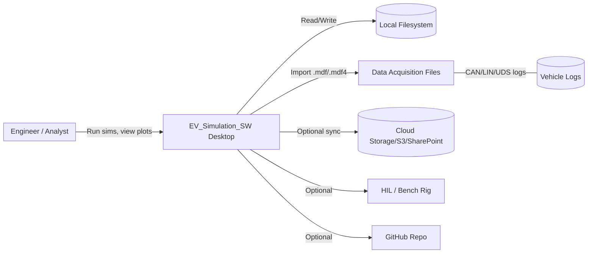
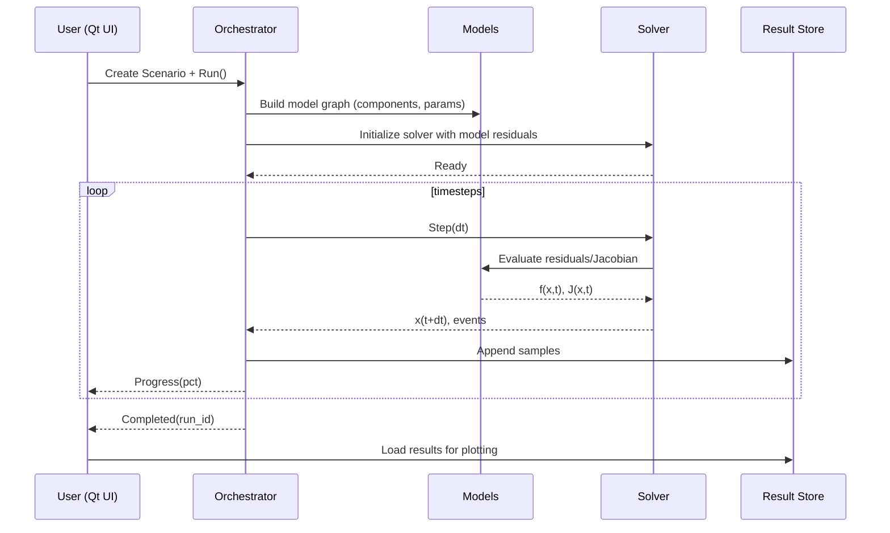
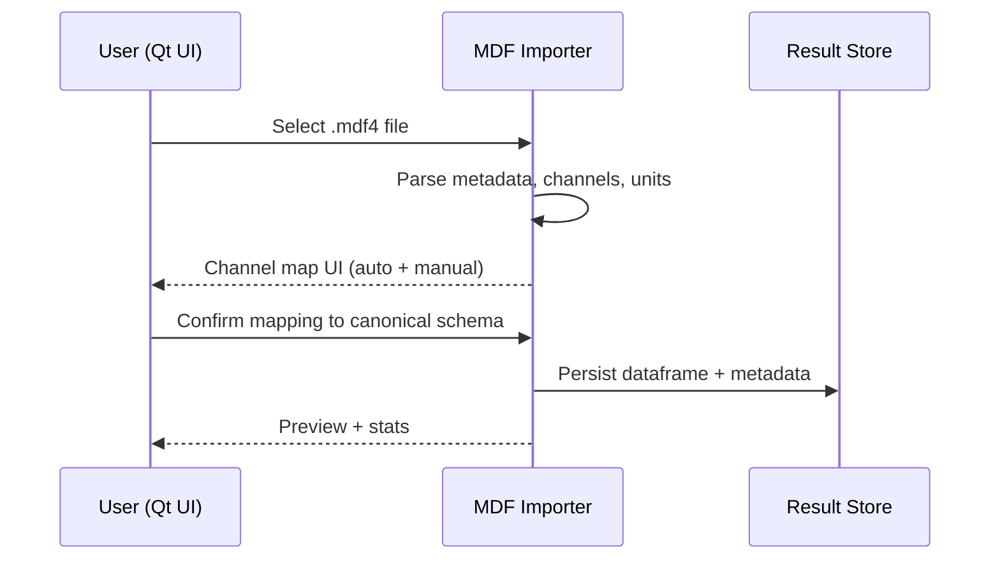
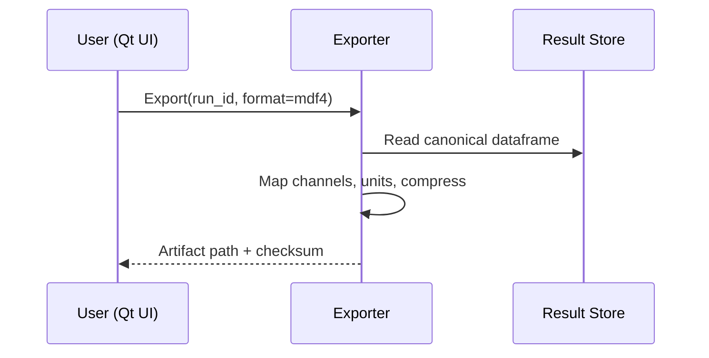

# EV_Simulation_SW — System & Software Architecture

> **Project**: EV_Simulation_SW  
> **Owner**: RRK0123  
> **Version**: 0.1 (Draft)  
> **Date**: 28 Sep 2025  
> **Status**: For review / iteration

---

## 1. Purpose & Scope
This document defines the **System Architecture** and **Software Architecture** for *EV_Simulation_SW*, an engineering toolchain that simulates EV subsystems (battery pack, power electronics, vehicle-level energy flow), visualizes results, and exports/ingests timeseries data in **.dat**, **.mdf**, and **.mdf4** formats. It targets desktop use with optional links to HIL/bench equipment and cloud storage for data archival.

### 1.1 Goals
- Provide a clear architecture for implementation and onboarding.
- Standardize interfaces (APIs, file formats, messages) across modules.
- Enable accurate simulation runs, reproducible results, and smooth data import/export.
- Support extensibility (new models, solvers, and visualizations) via a plugin mechanism.

### 1.2 Non-Goals
- Detailed mathematical model derivations (kept in Model Specs).  
- ECU-level firmware design (documented separately if needed).

---

## 2. System Architecture (C4: Context + Container Views)

### 2.1 Context Diagram


### 2.2 Container / Deployment View
```mermaid
flowchart TB
    subgraph Workstation[Windows/Linux Workstation]
        UI[Qt/C++ UI]
        Orchestrator[Simulation Orchestrator (Py/C++)]
        Models[Model Library (Battery, BMS, Drive, Aux)]
        Solvers[Solver Interface (PyBaMM/NumPy/SciPy)]
        IO[Data I/O: Importers(.mdf/.mdf4/.dat), Exporters]
        Storage[Result Store (Parquet/CSV/MDF4)]
        Plugins[Plugin Host (C++/Python)]
        Telemetry[Logging & Telemetry]
    end

    UI <--> Orchestrator
    Orchestrator <--> Models
    Orchestrator <--> Solvers
    Orchestrator <--> IO
    Orchestrator <--> Storage
    Orchestrator <--> Plugins
    UI <--> Storage
    Telemetry --> Storage

    subgraph OptionalServices[Optional Services]
      CloudStore[(Cloud Bucket)]
      HILRig[HIL / DAQ Instruments]
      VCS[GitHub (Repo & Issues)]
    end

    IO <--> CloudStore
    IO <--> HILRig
    Telemetry --> VCS
```

### 2.3 Key System Components
- **Workstation/Desktop**: Primary execution environment (Windows/Linux).  
- **HIL/Bench (optional)**: Data acquisition and closed-loop testing.  
- **Cloud Storage (optional)**: Versioned result archives and collaboration.  
- **GitHub (optional)**: Source code, issues, and CI artifacts.

### 2.4 Quality Attributes
- **Performance**: Simulate 1h drive cycle (10 Hz) < 5 min on typical laptop.
- **Reliability**: Deterministic runs given fixed seed & config.
- **Usability**: One-click run, live progress, and post-run drill-down.
- **Portability**: Windows/Linux parity; Mac best-effort.
- **Extensibility**: Plugins for models, solvers, exporters.
- **Data Interop**: First-class .mdf/.mdf4 import and export.

---

## 3. Software Architecture (Module & Interface View)

### 3.1 Layered Overview
```mermaid
flowchart TB
    Presentation[Presentation Layer (Qt/C++ UI)]
    App[Application Layer (Orchestration, Use-cases)]
    Domain[Domain Layer (Models, Simulation Kernel)]
    Infra[Infrastructure (I/O, Storage, Logging, Plugins)]

    Presentation --> App --> Domain --> Infra
    Presentation <--> Infra
```

### 3.2 Module Catalog (with Responsibilities & I/O)

| Module | Responsibility | Inputs | Outputs |
|---|---|---|---|
| **Qt UI** | Scenario setup, run control, dashboards, plots | User actions, project config | Orchestrator commands, visualizations |
| **Simulation Orchestrator** | Build DAG of model steps; manage runs, seeds, checkpoints | Scenario config, model params | Timeseries, events, run metadata |
| **Model Library** | Battery pack, BMS, inverter/motor, thermal, auxiliaries | Params, states, solver callbacks | State transitions, metrics |
| **Solver Interface** | Adapt domain ODE/DAE to backends (PyBaMM/SciPy) | Model residuals/Jacobians | Integrated states, step events |
| **Data Importers** | Parse **.mdf/.mdf4/.dat**, map signals | Files, channel maps | Canonical dataframe + metadata |
| **Data Exporters** | Export results to **.mdf/.mdf4/.dat**, CSV, Parquet | Canonical dataframe + metadata | Artifacts on disk/cloud |
| **Result Store** | Manage runs, indexes, caching | Timeseries, metadata | Versioned datasets, previews |
| **Plugin Host** | Discover/load plugins (C++/Python) | Plugin packages | Extended UIs, models, exporters |
| **Logging/Telemetry** | Structured logs, metrics, traces | All modules | Log files, perf counters |
| **Config Service** | Typed config, schema validation | YAML/JSON | Validated config, defaults |

#### Canonical Timeseries Schema (excerpt)
- **Index**: `timestamp` (ns), `sample_id` (int)  
- **Core Channels**: `pack.V`, `pack.I`, `pack.T_mean`, `soc`, `soh`, `pwr_elec_loss`, `veh_speed`, `ambient.T`  
- **Metadata**: `run_id`, `scenario_id`, `git_sha`, `seed`, `sim_version`  

### 3.3 Message Bus / Events (In-Process)
- `Run.Started(run_id)`
- `Run.Progress(run_id, t, pct)`
- `Run.Checkpoint(run_id, path)`
- `Run.Completed(run_id, artifacts[])`
- `Run.Failed(run_id, error, diagnostics)`
- `IO.Imported(file, channels[], mapping)`
- `IO.Exported(run_id, format, path)`

### 3.4 Key Use-Case Sequences

#### 3.4.1 Run Simulation


#### 3.4.2 Import MDF4


#### 3.4.3 Export to MDF4 / DAT


### 3.5 Concurrency & Threading
- **UI Thread**: Qt event loop.  
- **Worker Pool**: Orchestrator steps, parsing, and exports on background workers.  
- **Solver Threads**: Backend-controlled (NumPy/SciPy/OpenMP).  
- **Data Flow**: Producer (solver) → ring buffer → consumer (store/export) to avoid UI jank.

### 3.6 Error Handling & Resilience
- Structured errors with error codes (`SIM_INIT_FAIL`, `IMPORT_MAP_ERR`, `EXPORT_UNIT_MISMATCH`).
- Automatic checkpointing every N seconds or on events.  
- Crash-safe result store (write-ahead logs or atomic file writes).

### 3.7 Configuration & Schemas
- **Project file**: `project.yaml` (scenarios, datasets, units).  
- **Scenario file**: `scenario.yaml` (drive cycle, ambient, pack conf, solver opts).
- JSON Schema validation on load; defaults + deprecation map.

### 3.8 Security & Integrity
- File integrity with SHA-256 checksums for exported artifacts.  
- Optional signed manifests for regulated environments.  
- Least-privilege file access; no network access unless enabled.

### 3.9 Performance Targets (initial)
- Import **1 GB MDF4** < 60 s.  
- Export **500 MB MDF4** < 45 s.  
- Simulation **10 Hz × 3600 s** < 5 min (laptop-class CPU/GPU).

### 3.10 Technology Stack (baseline)
- **UI**: C++/Qt 6, QML for views.  
- **Core**: Python 3.11 (or C++ where needed) for orchestration + models.  
- **Solvers**: PyBaMM, SciPy integrators, (optional) Sundials via wrappers.  
- **Data**: pandas, PyTables/pyarrow; asammdf for MDF; custom DAT reader/writer.
- **Plugins**: Entry points (Python) and shared libs (C++), semantic versioning.

### 3.11 Repository Layout (proposed)
```
EV_Simulation_SW/
  app/
    ui_qt/
    resources/
  core/
    orchestrator/
    models/
    solvers/
    plugins/
  io/
    importers/
      mdf/
      dat/
    exporters/
      mdf/
      dat/
  storage/
  configs/
    schemas/
  tests/
  docs/
  scripts/
```

### 3.12 Public Interfaces (selected)
**Orchestrator API (Python)**
```python
run_id = orchestrator.run(scenario: ScenarioCfg) -> str
progress: Iterator[RunProgress] = orchestrator.progress(run_id)
result = orchestrator.result(run_id) -> DatasetRef
```

**Importer API**
```python
df, meta = import_mdf4(path: str, mapping: ChannelMap) -> (DataFrame, Dict)
```

**Exporter API**
```python
artifact = export(dataset: DatasetRef, fmt: Literal["mdf4","dat","csv","parquet"], opts: ExportOpts) -> Path
```

### 3.13 Variable / Message Naming Conventions (excerpt)
- **Signals**: `subsystem.signal` (e.g., `pack.V`, `pack.I`, `motor.torque`).
- **Units**: SI-first; unit suffix in metadata (e.g., `V`, `A`, `°C`).
- **Params**: `component.param_name` (e.g., `bms.max_discharge_current`).
- **Events**: `Domain.Action` (e.g., `Run.Completed`).

### 3.14 Data Mapping Examples
| Canonical | MDF Channel | Unit | Note |
|---|---|---|---|
| `pack.V` | `BATT_Pack_V` | V | Avg pack voltage |
| `pack.I` | `BATT_Pack_I` | A | Positive = discharge |
| `soc` | `BATT_SOC` | % | 0–100 |
| `veh_speed` | `Vehicle_Speed` | km/h | Converted to m/s if needed |

---

## 4. Non-Functional Requirements (NFRs)
- **Reliability**: 99.5% successful run rate over last 100 runs.  
- **Observability**: Logs include `run_id`, `scenario_id`, and timing for each stage.  
- **Internationalization**: Units and locale-aware number formatting.  
- **Accessibility**: Keyboard-first UI, high-contrast theme.

---

## 5. Compliance & Standards
- **ASAM MDF** for data exchange.  
- **CSV/Parquet** for analytics portability.  
- **Semantic Versioning** for plugins and data schema.

---

## 6. Risks & Mitigations
- **Large MDF files** → Streaming reader, chunked processing, memory caps.  
- **Unit mismatches** → Centralized unit registry + validation rules.  
- **Solver instability** → Step-size control, fallback integrators, event handling.  
- **UI freeze** → Strict separation of UI thread and workers.

---

## 7. Open Questions (to finalize with team)
1. Which cloud store to standardize (S3 vs SharePoint vs none)?
2. Do we require signed artifacts (hash + signature) for exports?
3. Target minimal plugin ABI (Python only vs Python + C++ binaries)?
4. Preferred default export format: MDF4 or Parquet?

---

## 8. Appendix

### 8.1 Sequence of Startup
1. Load config → validate schema → load last project.  
2. Initialize plugin host and discover providers.  
3. Warm up solvers (lazy init) and caches.  
4. Ready UI dashboards.

### 8.2 Example Scenario YAML (snippet)
```yaml
scenario_id: WLTP_25C
seed: 42
ambient:
  T: 25C
  wind: 1.5mps
pack:
  cells: 96s10p
  capacity_Ah: 100
solver:
  backend: scipy
  dt: 0.1
  rtol: 1e-6
  atol: 1e-8
outputs:
  channels: [pack.V, pack.I, soc, veh_speed]
```

### 8.3 UI Navigation (proposed)
- **Home**: Recent projects, create/open.  
- **Scenarios**: Define runs, parameters, seeds.  
- **Run**: Live progress, logs, cancel/pause.  
- **Explore**: Plots, cursors, statistics, comparisons.  
- **Import/Export**: MDF/DAT/CSV/Parquet wizards.  
- **Settings**: Units, themes, plugins, cache.
